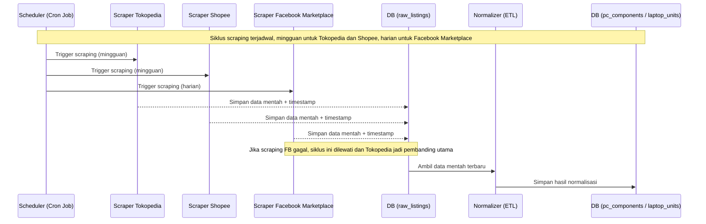
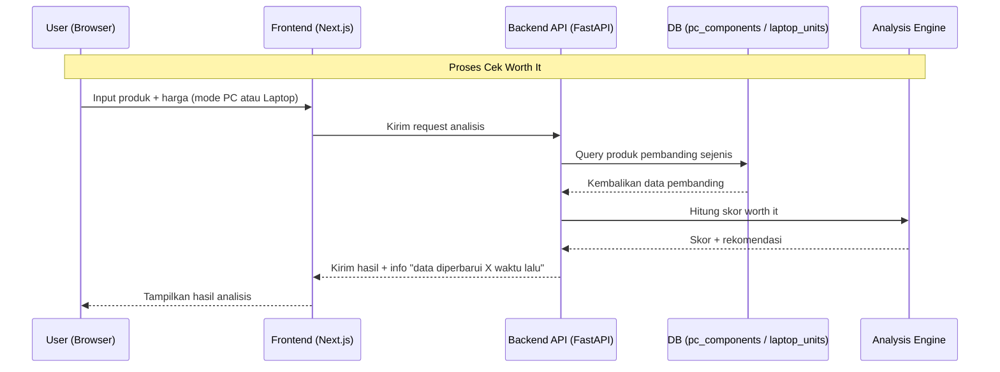
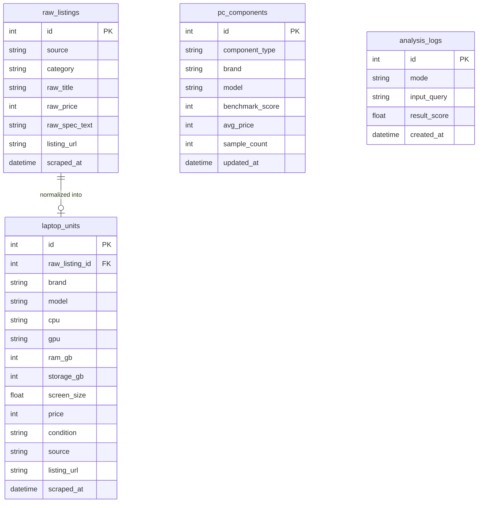

# PRD - HargaPas

## 1. Overview
HargaPas adalah aplikasi web yang membantu calon pembeli menilai apakah harga PC rakitan atau laptop yang mereka temukan di marketplace itu wajar. Masalah yang coba diselesaikan adalah minimnya validasi harga yang cepat dan berbasis data pasar nyata. Saat ini calon pembeli biasanya bertanya di grup jual beli Facebook dan sering tidak mendapat balasan, atau bertanya ke chatbot AI yang datanya tidak selalu mengikuti kondisi pasar terkini dan tidak mencocokkan produk dengan pembanding nyata.

Tujuan utama aplikasi adalah menyediakan platform yang mengumpulkan harga dari tiga sumber pasar (Facebook Marketplace, Tokopedia, Shopee) secara terjadwal, lalu menghitung skor worth it untuk produk yang ditanyakan user berdasarkan pembanding harga dan spesifikasi sejenis. Aplikasi punya dua mode, PC untuk komponen individual dan Laptop untuk unit utuh, karena struktur harga dan cara menilai keduanya berbeda.

## 2. Requirements
Berikut adalah persyaratan tingkat tinggi untuk pengembangan sistem:
- **Aksesibilitas:** Aplikasi berbasis web, bisa diakses lewat browser desktop maupun mobile.
- **Pengguna:** Publik umum, tanpa proses login untuk versi awal, siapa saja bisa langsung cek.
- **Sumber Data:** Harga dan spesifikasi diambil otomatis lewat scraping terjadwal dari Facebook Marketplace, Tokopedia, dan Shopee, bukan lewat input manual admin.
- **Freshness Data:** Data pembanding diperbarui lewat cron job, bukan scraping real-time per request. Setiap hasil analisis menampilkan kapan data pembanding terakhir diperbarui.
- **Mode Penilaian:** Dua mode terpisah, PC (komponen individual seperti GPU, CPU, RAM) dan Laptop (unit utuh dengan kombinasi spesifikasi), yang bisa dipindah dari halaman yang sama.
- **Fallback Sumber Data:** Kalau scraping Facebook Marketplace gagal pada suatu siklus, sistem otomatis mengandalkan Tokopedia sebagai sumber pembanding utama untuk siklus tersebut.

## 3. Core Features
Fitur-fitur kunci yang harus ada dalam versi pertama (MVP):

1. **Halaman Cek Worth It**
   - Toggle mode PC / Laptop.
   - Form input produk yang mau dicek beserta harga yang ditemukan user.
2. **Hasil Analisis dan Rekomendasi**
   - Skor worth it (wajar, kemahalan, atau ada opsi lebih baik).
   - Daftar produk pembanding yang jadi acuan skor, lengkap harga dan sumbernya.
   - Info timestamp "data diperbarui X waktu lalu" di tiap hasil.
3. **Pipeline Scraping Terjadwal**
   - Modul scraper terpisah per sumber (Tokopedia, Shopee, Facebook Marketplace), jalan independen satu sama lain.
   - Fallback otomatis ke Tokopedia kalau siklus scraping Facebook Marketplace gagal.
4. **Katalog Pembanding**
   - Tabel `pc_components` untuk skor performa dan rata-rata harga per komponen.
   - Tabel `laptop_units` untuk unit laptop yang sudah dinormalisasi dari hasil scraping.

## 4. User Flow
Alur kerja sederhana bagi user saat menggunakan aplikasi:

1. **Pilih Mode:** User membuka HargaPas dan memilih mode PC atau Laptop.
2. **Input Produk:** User memasukkan produk yang ingin dicek, misalnya "RTX 4060, harga Rp 3.500.000" untuk mode PC, atau spesifikasi lengkap dan harga untuk mode Laptop.
3. **Pencarian Pembanding:** Sistem mencari produk sejenis dari katalog yang sudah dinormalisasi, bukan scraping langsung saat itu juga.
4. **Perhitungan Skor:** Analysis engine menghitung posisi harga produk yang ditanya relatif terhadap pembanding, lalu menyusun rekomendasi.
5. **Tampilkan Hasil:** Skor, daftar pembanding, dan info freshness data ditampilkan ke user.

## 5. Architecture
Sistem punya dua alur utama yang berjalan terpisah. Siklus scraping terjadwal mengisi katalog pembanding di background lewat cron job, sementara alur request user cuma membaca dari katalog yang sudah jadi, tanpa perlu menunggu proses scraping.

### 5.1 Alur Scraping Terjadwal (Cron Job)

### 5.2 Alur Cek Worth It (Request User)

## 6. Database Schema

Berikut adalah Entity Relationship Diagram (ERD) yang menggambarkan struktur database utama:

| Tabel | Deskripsi |
|-------|-----------|
| **raw_listings** | Landing table, menyimpan hasil scraping mentah apa adanya dari tiga sumber sebelum diproses |
| **pc_components** | Katalog agregat komponen PC, satu baris per model komponen dengan rata-rata harga dan skor performa dari semua sumber |
| **laptop_units** | Hasil normalisasi tiap listing laptop individual, karena kombinasi spesifikasinya unik per unit |
| **analysis_logs** | Log setiap kali user melakukan cek worth it, dipakai untuk audit dan data dukung pengukuran dampak |

## 7. Design & Technical Constraints

### 7.1 Tech Stack
Rekomendasi paling pas buat HargaPas: **Python dengan FastAPI** untuk backend, scraper, dan scheduler dalam satu codebase yang sama, **PostgreSQL** (lewat Supabase biar setup-nya cepat) untuk database, dan **Next.js** untuk frontend.

Alasannya, scraping dan normalisasi data paling kuat dikerjakan di Python lewat requests, BeautifulSoup, dan pandas. Kalau backend API juga pakai Python lewat FastAPI, seluruh logic data (scraping, cron, analysis engine) jalan di satu bahasa yang sama tanpa perlu integrasi lintas bahasa. Pendekatan ini juga selaras dengan pengalaman yang sudah ada di kompetisi data (Kaggle) dan sistem fuzzy Tsukamoto, karena logic scoring worth it nantinya bisa dikembangkan dengan pendekatan serupa. Next.js dipilih untuk frontend karena pola ini sudah pernah dipakai di proyek hackathon sebelumnya, jadi kurva belajarnya rendah.

### 7.2 Jadwal Scraping (Cron Interval)
Harga komponen baru di Tokopedia dan Shopee relatif stabil kecuali saat momen flash sale, jadi siklus mingguan cukup masuk akal untuk dua sumber itu. Facebook Marketplace beda kasus, karena yang berubah cepat di sana bukan cuma harga, tapi status ketersediaan listing itu sendiri. Barang second populer bisa laku dan hilang dari marketplace dalam hitungan hari, jadi siklusnya dibuat lebih sering supaya sistem tidak merekomendasikan unit yang sebenarnya sudah tidak tersedia.

| Sumber | Interval | Alasan |
|---|---|---|
| Tokopedia | Mingguan | Harga retail relatif stabil kecuali saat flash sale |
| Shopee | Mingguan | Sama seperti Tokopedia, plus proteksi anti-bot lebih ketat sehingga request dijaga tidak terlalu sering |
| Facebook Marketplace | Harian | Listing second cepat berubah status (terjual atau hilang), bukan cuma soal harga |

### 7.3 Batasan Scraping
Scraping Tokopedia dilakukan penuh lewat HTTP request ke halaman pencarian publik, tanpa browser otomatis, supaya lebih ringan dan risiko ke-block lebih kecil. Shopee dan Facebook Marketplace butuh penanganan request yang lebih hati-hati karena proteksi anti-botnya lebih ketat. Kalau siklus scraping Facebook Marketplace gagal, sistem otomatis memakai Tokopedia sebagai sumber pembanding utama untuk siklus tersebut, dan data Facebook yang lama ditandai stale.
